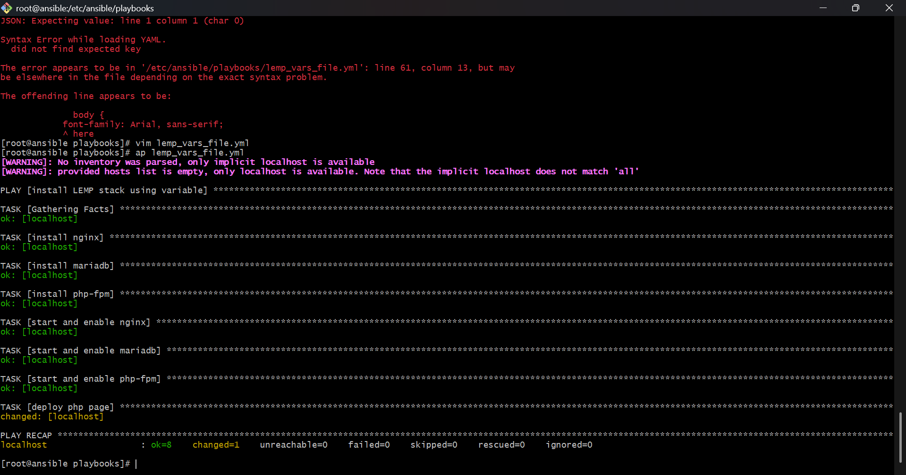
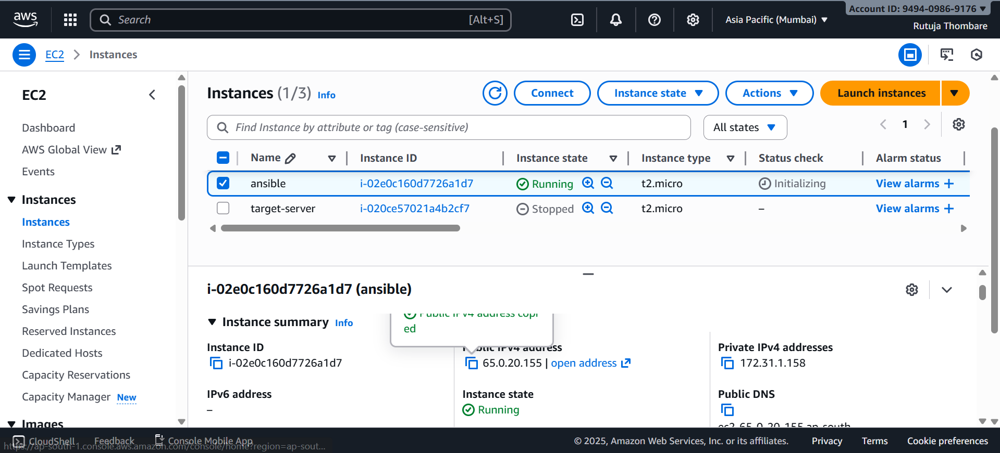
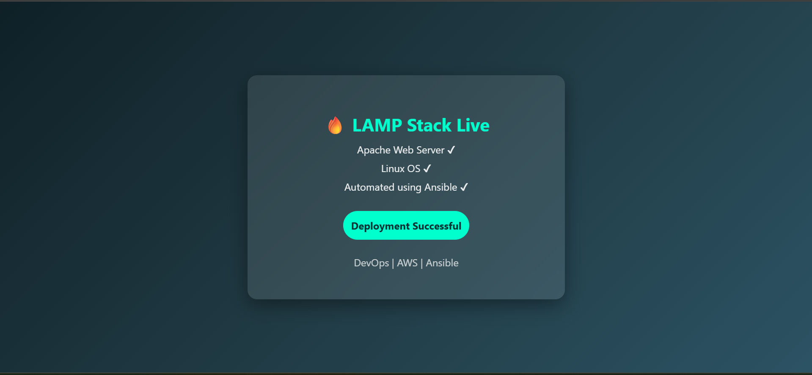
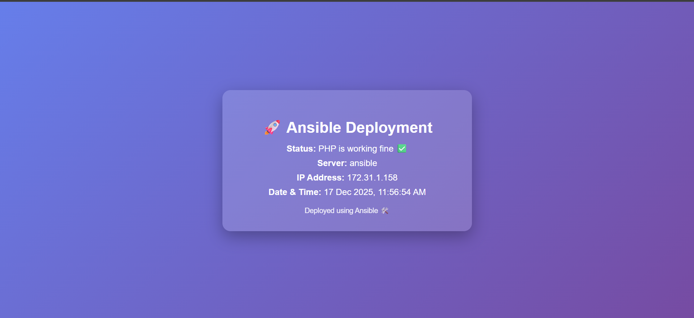

# 🚀 Ansible Automation: LAMP & LEMP Stack Deployment

This project demonstrates automated deployment of both LAMP and LEMP stacks using Ansible.

## Project Overview
- Deploy LAMP (Apache, PHP, MySQL)

lamp.yml

---
- name: install lamp in amazon linux
  hosts: localhost
  become: yes
  tasks:
  
  - name: install httpd package
    ansible.builtin.dnf:
      name: httpd
      state: present
 
  - name: install mariadb package
    ansible.builtin.dnf:
      name: mariadb105-server
      state: present
  
  - name: install php package
    ansible.builtin.dnf:
      name:
       - php
       - php-fpm
      state: present
  
  - name: start and enable httpd
    ansible.builtin.systemd_service:
      name: httpd
      state: started
      enabled: true
  
  - name: start and enable mariadb
    ansible.builtin.systemd_service:
      name: mariadb
      state: started
      enabled: true
  
  - name: start and enable php
    ansible.builtin.systemd_service:
      name: php-fpm
      state: started
      enabled: true

  - name: deploy php
    ansible.builtin.copy:
     dest: /var/www/html/index.html
     content: |
      <!DOCTYPE html>
      <html lang="en">
      <head>
      <meta charset="UTF-8">
      <title>Ansible LAMP Deployment</title>
      
        </head>
        <body>

        

        <h1>🔥 LAMP Stack Live</h1>
        
Apache Web Server ✔

        
Linux OS ✔

        
Automated using Ansible ✔

        
Deployment Successful

        <footer>
            
DevOps | AWS | Ansible

        </footer>
       

       </body>
       </html>

   

- Deploy LEMP (Nginx, PHP-FPM, MySQL) with the use of variables

lemp.yml

---
- name: install LEMP stack using variable
  hosts: localhost
  become: yes

  vars:
    web_pkg: nginx # hard codeing
    db_pkg: mariadb105-server
    php_pkg:
     - php
     - php-fpm
    web_service: nginx
    db_service: mariadb
    php_service: php-fpm
    web_file_path: /usr/share/nginx/html/index.php
  tasks:
  - name: install nginx
    ansible.builtin.dnf:
      name: "{{web_pkg}}" # variable call
      state: present
  - name: install mariadb
    ansible.builtin.dnf:
      name: "{{db_pkg}}"
      state: present
  - name: install php-fpm
    ansible.builtin.dnf:
      name: "{{php_pkg}}"
      state: present
  - name: start and enable nginx
    ansible.builtin.systemd_service:
      name: "{{web_service}}"
      state: started
      enabled: true
  - name: start and enable mariadb
    ansible.builtin.systemd_service:
      name: "{{db_service}}"
      state: started
      enabled: true
  - name: start and enable php-fpm
    ansible.builtin.systemd_service:
      name: "{{php_service}}"
      state: started
      enabled: true
  - name : deploy php page
    ansible.builtin.copy:
      dest: "{{web_file_path}}"
      content: |
        <?php
        phpinfo();
        ?>

- Handle port 80 conflicts
- Deploy PHP application using Ansible

## Tech Stack
- Ansible
- Apache / Nginx
- PHP
- MySQL / MariaDB
- AWS EC2

## How to Run
ansible-playbook -i inventory lamp-playbook.yml
ansible-playbook -i inventory lemp-playbook.yml

## Screenshots
Add screenshots.

## Author
Rutuja Thombare
